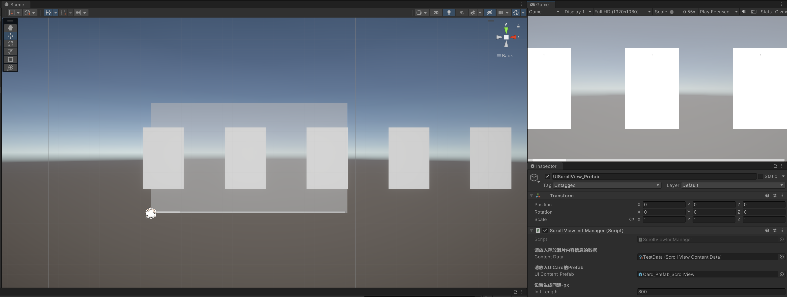
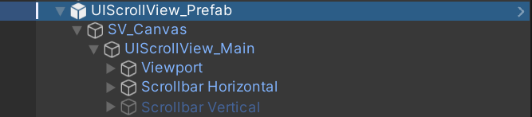
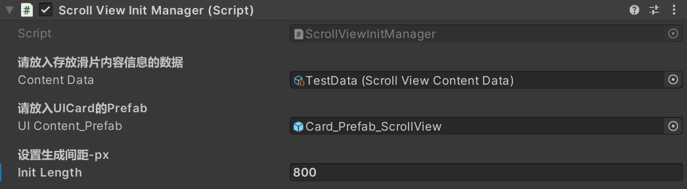

# Samples-of-UIPrefab-for-Unity
#一些Unity.UI的呈现方式案例的制作，用于数据在Unity中展示
## [更新]一些关于列表滑动、悬浮卡牌等基于相应数据结构生成对应模板并显示在Unity.UI中
About UI Prefabs of Digital_Exhibition.

> **目前已更新列表滑动和悬浮卡牌的UIPrefab的制作**
* 列表滑动 (已完成)
* 悬浮卡牌 (已完成)
* 放映机效果（使用额外插件/Shader）`正在开发`

---

### 列表滑动的制作思路
使用`ScrollView`在`ScriptableObject`的数据中动态加载相关内容，并添加到`ScrollRect.content`中，以达到可滑动列表的效果。
> 计划设计可反转的滑片，利用`Raycast`检测对应正反面的触发器，控制`Animator`来进行滑片反转的动效。

---

### 列表滑动的内容配置
* **配置数据**\
在`Project`操作区域内右键创建`ScriptableObject`数据，并在`Inspector`中点击`Add to the list`的`+`号，对序列化的列表进行添加和编写数据。并把ScrollView_Prefab拖入到Hierarchy中。
* **开始**\
下面是列表滑动的Unity编辑器内的预览图\
\
在`ScrollViewScripts`文件夹中有测试用的`TestDatas`，将测试数据拖进`UIScrollView_Prefab`的`Inspector`中的`Content Data`中。并按照`Inspector`中`Scroll View Init Manage(Script)`组件`[Header]`头标题的说明将相关的Prefab拖进对应变量中。`UI Content_Prefab`中的`Prefab`在`InitPrefabs`文件夹中。\
 \
**下面是UIScrollView在Hierarchy中的布局**\
 \
\
 \
**下面是Inspector中的存放数据的public变量**\
 \

---

### 悬浮卡牌的制作思路
通过Animator来控制Animation的播放，激活loop来循环播放卡牌悬浮的动画来实现悬浮卡牌的动效。
> 欲实现相同动画不同播放初始化时间的效果来达到不同步悬浮的效果。

---
